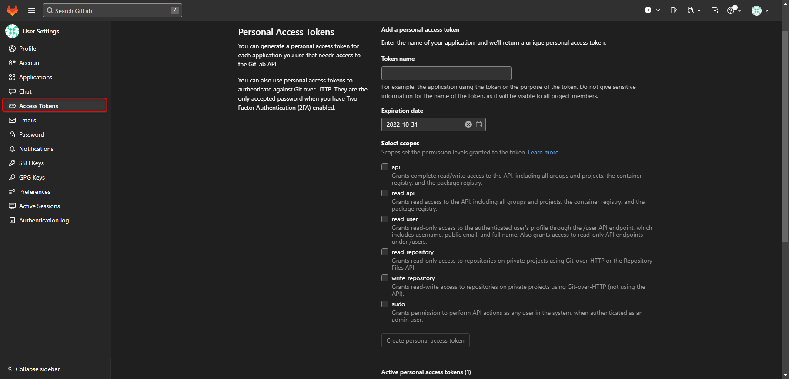

<!-- DISCLAIMER -->
<!-- This README uses the template provided by 
*** [othneildrev](https://github.com/othneildrew/Best-README-Template/blob/master/README.md)
*** and is licensed under the MIT creative commons license. (2022-09-30)
*** Please support the channel.
-->
# GitLab User Administration
<!-- <a name="readme-top"></a> -->

<!-- PROJECT SHIELDS -->
<!--
*** I'm using markdown "reference style" links for readability.
*** Reference links are enclosed in brackets [ ] instead of parentheses ( ).
*** See the bottom of this document for the declaration of the reference variables
*** for contributors-url, forks-url, etc. This is an optional, concise syntax you may use.
*** https://www.markdownguide.org/basic-syntax/#reference-style-links
-->
[![Contributors][contributors-shield]][contributors-url]
[![Forks][forks-shield]][forks-url]
[![Stargazers][stars-shield]][stars-url]
[![Issues][issues-shield]][issues-url]
[![MIT License][license-shield]][license-url]
[![LinkedIn][linkedin-shield]][linkedin-url]

<!-- PROJECT LOGO -->
<br />
<div align="center">
  <a href="https://github.com/weinmann-phil/terraform-gitlab-user-management">
    
  </a>

  <h3 align="center">GitLab User Management</h3>

  <p align="center">
    Central user management with Terraform 
    <br />
    <a href="https://github.com/weinmann-phil/terraform-gitlab-user-management"><strong>Explore the docs »</strong></a>
    <br />
    <br />
    <a href="https://github.com/weinmann-phil/terraform-gitlab-user-management">View Demo</a>
    ·
    <a href="https://github.com/weinmann-phil/terraform-gitlab-user-management/issues">Report Bug</a>
    ·
    <a href="https://github.com/weinmann-phil/terraform-gitlab-user-management/issues">Request Feature</a>
  </p>
</div>

<!-- OVERVIEW -->
## 0. Overview

This project is designed to allow non-technical users to easily manage user 
administration for a self-hosted GitLab instance.

Here's why:

* Administrative access should be restricted to few technical personel (e.g. your Sys-Admin, DevOps, etc.)
* Recruiters are in charge of finding and onboarding of new staff members
* Recruiters should have an overview of all active members in GitLab
* Recruiters should, thus, only be able to add new members and not request this of technical staff

<!-- TABLE OF CONTENTS -->
<details>
  <summary>Table of Contents</summary>
  <ol start="0">
    <li>
      <a href="#0.-overview">Overview</a>
      <ul>
        <li><a href="#built-with">Built With</a></li>
      </ul>
    </li>
    <li>
      <a href="#getting-started">Getting Started</a>
      <ul>
        <li><a href="#prerequisites">Prerequisites</a></li>
        <li><a href="#installation">Installation</a></li>
      </ul>
    </li>
    <li><a href="#usage">Usage</a></li>
    <li><a href="#roadmap">Roadmap</a></li>
    <li><a href="#contributing">Contributing</a></li>
    <li><a href="#license">License</a></li>
    <li><a href="#contact">Contact</a></li>
    <li><a href="#acknowledgments">Acknowledgments</a></li>
  </ol>
</details>

<p align="right">(<a href="#gitlab-user-administration">back to top</a>)</p>

<!-- Dependencies/technologies -->
### Built With

For this project we are using mainly Terraform with the gitlabhq provider to manage GitLab.
Please check out their respective documentation:

[![Terraform][Terraform]][Terraform-url]

[![GitLab][GitLab]][GitLab-url]

<p align="right">(<a href="#gitlab-user-administration">back to top</a>)</p>

<!-- GETTING STARTED -->
## Getting Started

For a local setup, you need to have `Docker` and `Terraform` installed and have
an official Docker container for the GitLab community edition running.
If you have not yet installed these items, please take the following steps:

### Prerequisites

* Install Docker

  ```sh
  sudo apt install gnome-terminal
  sudo apt update
  sudo apt install ./docker-desktop-<version>-<arch>.deb
  ```

* Install Terraform

  ```sh
  sudo apt-get update && sudo apt-get install -y gnupg software-properties-common
  wget -O- https://apt.releases.hashicorp.com/gpg | gpg --dearmor | sudo tee /usr/share/keyrings/hashicorp-archive-keyring.gpg
  gpg --no-default-keyring --keyring /usr/share/keyrings/hashicorp-archive-keyring.gpg --fingerprint
  echo "deb [signed-by=/usr/share/keyrings/hashicorp-archive-keyring.gpg] https://apt.releases.hashicorp.com $(lsb_release -cs) main" | sudo tee /etc/apt/sources.list.d/hashicorp.list
  sudo apt update
  sudo apt install terraform
  ```

* Run a local instance of GitLab CE

  ```sh
  sudo docker run -d \
  -p 443:443 -p 80:80 -p 22:22 \
  --hostname localhost \
  --name gitlab-ce \
  --restart always \
  -v $GITLAB_HOME/config:/etc/gitlab \
  -v $GITLAB_HOME/logs:/var/log/gitlab \
  -v $GITLAB_HOME/data:/var/opt/gitlab \
  --shm-size 256m \
  gitlab/gitlab-ce:latest
  ```

* Create an access token with administrative privileges

### Installation

> __NOTE__:
>
> This is a sample usage of this project.
> If you are applying this within any environments other than a local test environment,
> please mind to change the settings for the provider configuration and the backend
> configurations.
>
> Otherwise, this will not work.

1. Set up your self-hosted GitLab system

   ```sh
   sudo docker run -d \
   -p 443:443 -p 80:80 -p 22:22 \
   --hostname localhost \
   --name gitlab-ce \
   --restart always \
   -v $GITLAB_HOME/config:/etc/gitlab \
   -v $GITLAB_HOME/logs:/var/log/gitlab \
   -v $GITLAB_HOME/data:/var/opt/gitlab \
   --shm-size 256m \
   gitlab/gitlab-ce:latest
   ```

1. Create an access token with administrative privileges
   
   <details>
     <summary>Create access token</summary>

     

   </details>

1. Enter token and a list of users into terraform.tfvars

1. Switch directory to the workspace

   ```sh
   cd environments/gitlab/
   ```

1. Initialize project

   ```sh
   terraform init
   ```

1. Apply changes to your GitLab

   ```sh
   terraform apply
   ```

<p align="right">(<a href="#gitlab-user-administration">back to top</a>)</p>


<!-- USAGE EXAMPLES -->
## Usage

This backend is useful to have a single source of truth for user management within GitLab.
Combined with a GitLab pages form, it allows recruiters to add users, be they freelancers
or permanent staff, without the need of anyone with administrative rights.

With the GitLab provider, it is possible to control the amount of access one gets without
enabling erroneous deletions and the like.

<p align="right">(<a href="#gitlab-user-administration">back to top</a>)</p>


<!-- ROADMAP -->
## Roadmap

- [x] Add Changelog
- [x] Add License
- [x] Add the Terraform backend configurations and modules
- [x] Add Readme
- [ ] Add Group and Repository IAM (expand the logic)
- [ ] Add GitLab Pages sample
- [ ] Add a GitLab CI pipeline configuration
- [ ] Add an overview (expand the logic)
   
See the [open issues](https://github.com/weinmann-phil/terraform-gitlab-user-management/issues) for a full list of proposed features (and known issues).

<p align="right">(<a href="#gitlab-user-administration">back to top</a>)</p>


<!-- CONTRIBUTING -->
## Contributing

This is my first project in an attempt in giving back to the community.
Any contributions you make are **greatly appreciated**.

If you have a suggestion that would make this better, please fork the repo and create a pull request. 
You can also simply open an issue with the tag "enhancement".
Don't forget to give the project a star! Thanks again!

1. Fork the Project
1. Create your Feature Branch (`git checkout -b feature/AmazingFeature`)
1. Commit your Changes (`git commit -m 'Add some AmazingFeature'`)
1. Push to the Branch (`git push origin feature/AmazingFeature`)
1. Open a Pull Request

<p align="right">(<a href="#gitlab-user-administration">back to top</a>)</p>


<!-- LICENSE -->
## License

Distributed under the MIT License. See `LICENSE` for more information.

<p align="right">(<a href="#gitlab-user-administration">back to top</a>)</p>


<!-- CONTACT -->
## Contact

Philip Weinmann - Philip.Weinmann@protonmail.com

Project Link: [https://github.com/weinmann-phil/terraform-gitlab-user-management](https://github.com/weinmann-phil/terraform-gitlab-user-management)

<p align="right">(<a href="#gitlab-user-administration">back to top</a>)</p>


<!-- ACKNOWLEDGMENTS -->
## Acknowledgments

* [README template](https://github.com/othneildrew/Best-README-Template)
* [Docker Installation Guide](https://docs.docker.com/engine/install/ubuntu)
* [Terraform Installation Guide](https://developer.hashicorp.com/terraform/tutorials/aws-get-started/install-cli)
* [GitLab Docker Installation Guide](https://docs.gitlab.com/ee/install/docker.html)
* [Terraform GitLab Provider](https://registry.terraform.io/providers/gitlabhq/gitlab/latest/docs)

<p align="right">(<a href="#readme-top">back to top</a>)</p>


<!-- MARKDOWN LINKS & IMAGES -->
<!-- https://www.markdownguide.org/basic-syntax/#reference-style-links -->
[contributors-shield]: https://img.shields.io/github/contributors/weinmann-phil/terraform-gitlab-user-management.svg?style=for-the-badge
[contributors-url]: https://github.com/weinmann-phil/terraform-gitlab-user-management/graphs/contributors
[forks-shield]: https://img.shields.io/github/forks/weinmann-phil/terraform-gitlab-user-management.svg?style=for-the-badge
[forks-url]: https://github.com/weinmann-phil/terraform-gitlab-user-management/network/members
[stars-shield]: https://img.shields.io/github/stars/weinmann-phil/terraform-gitlab-user-management.svg?style=for-the-badge
[stars-url]: https://github.com/weinmann-phil/terraform-gitlab-user-management/stargazers
[issues-shield]: https://img.shields.io/github/issues/weinmann-phil/terraform-gitlab-user-management.svg?style=for-the-badge
[issues-url]: https://github.com/weinmann-phil/terraform-gitlab-user-management/issues
[license-shield]: https://img.shields.io/github/license/weinmann-phil/terraform-gitlab-user-management.svg?style=for-the-badge
[license-url]: https://github.com/weinmann-phil/terraform-gitlab-user-management/blob/main/LICENSE
[linkedin-shield]: https://img.shields.io/badge/-LinkedIn-black.svg?style=for-the-badge&logo=linkedin&colorB=555
[linkedin-url]: https://linkedin.com/in/philipweinmann
[product-screenshot]: img/glab_user_mgmt_snapshot.png
[Terraform]: https://img.shields.io/badge/terraform-4A235A?style=for-the-badge&logo=terraform
[Terraform-url]: https://www.terraform.io/docs
[GitLab]: https://img.shields.io/badge/GitLab-FF8800?style=for-the-badge&logo=gitlab
[GitLab-url]: https://docs.gitlab.com/
